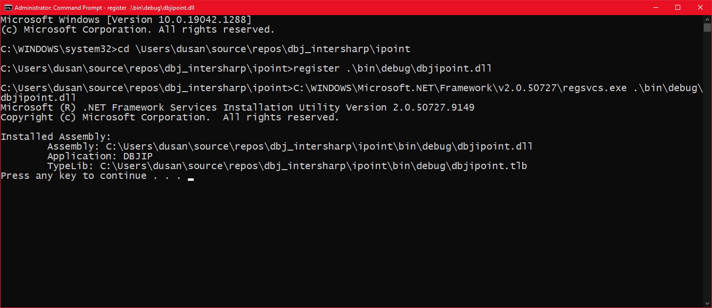

After building the com component one must register it, so it becomes "known" machine wide. 
That means com subsystem must be able to instantiate the dll where the com component by given prog id, resides.

For that please use the `register.cmd` , made available in here. Here is the screen dump after its successful use:



From above you can see how did we used the cmd provided:

```
register .\bin\debug\dbjipoint.dll
```

Obviously we will have to redo this for after the release build.

```
register .\bin\release\dbjipoint.dll
```

NOTE: this com component is .NET 2.0 dll. Which is perfectly OK. Keep it .NET 2.0. That way it can be registered on any Windows desktop that has installed any .NET after 2.0. Which by today (Nov 2021) is all of them.
